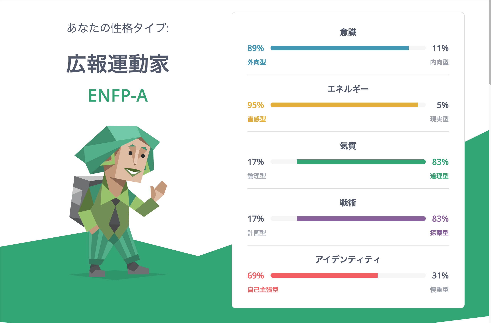

# Personality 人となり

## 基本情報

| key | value |
| ------- | ------- |
| 名前 | 吉本 康貴 (Koki Yoshimoto) |
| 生年月日 | 1991年3月7日 |
| 居住地 | 鹿児島県 鹿児島市 |
| ブログ (note) | [yoshikouki](https://note.com/yoshikouki) |
| Twitter | [@yoshikouki_](https://twitter.com/yoshikouki_) |
| GitHub | [yoshikouki](https://github.com/yoshikouki) |
| connpass | [yoshikouki](https://connpass.com/user/yoshikouki/) |
| Speaker Deck | [yoshikouki](https://speakerdeck.com/yoshikouki) |
| Zenn | [yoshikouki](https://zenn.dev/yoshikouki) |
| Qiita | [@yoshikouki](https://qiita.com/yoshikouki) |

- [Personality 人となり](../Personality/)
- [Curriculum Vitae 職務経歴書](../Curriculum-Vitae/)
- [Interests Profile 興味分野](../Interests-Profile/)

## 注意事項

- この資料は、私自身が変更時点で公開しても良いだろうと考えている情報を元に、一個人について言語化を図っています
- 公開と判断した情報は、「客観的であろうと判断できるもの」か「主観的でも今後大きく変わる可能性が低いと判断したもの」です
- そのため、公開情報は抽象的なものが多い傾向があります
- とはいえ変化する可能性はあり、最新の情報でない場合もあります

## 人生観

- MVV (Mission, Vision, Value) における Mission と Vision に相当するものという認識
- 人生の目的は、幸せになる
- 人生のゴールは、息絶える3秒前に「良い人生だった」と呟き逝く
- いずれにしろ、自身を満足させるのために生きたい。そのためには「全人」になる必要がある

| 幸せは脳内物質と密接に関係しており、欲求とも関係している | 幸せは経済的な余裕も必要である |
| ------- | ------- |
|  https://speakerdeck.com/yoshikouki/lu-er-dao-da-xue-fa-wen-xue-bu-jiang-yi-kiyarialun?slide=47 |  https://speakerdeck.com/yoshikouki/lu-er-dao-da-xue-fa-wen-xue-bu-jiang-yi-kiyarialun?slide=48 |

## Value 価値基準、行動指針

- 心身の健康を優先する。人間は思ったより弱い
- 子供との時間はすぐに少なくなる。可能な限り子供との時間を大切にする
  
  https://ourworldindata.org/time-with-others-lifetime
- 手の届く範囲の人に貢献したい
- 手の届く範囲を広げたい
- 人間が発達させた技術 (科学) は手段・道具として有用。また興味の対象でもある
- 人間は「認知 (神経系レベルの主観)」を元に生きている
  - 人間の活動において最も客観的だと思われる刺激 (5感) すらも結果的に認知されることから、客観的な情報そのものよりも「どのように認知したか」のほうが重要であると考える
- 自分の作ったプロダクトが社会 (多くの人間の集団) に貢献する状況が好ましい (嬉しい、楽しい、ワクワクするなど)

## Goals

WIP

### 短期 (365日内)

- [ ] 個人サービスをリリースして100円を稼ぐ
- [ ] 興味を持つ様々なビジネスについて、その原理原則 (勘所) を学ぶ

### 中期 (予測が可能そうな範囲: 2〜3年内)

- [ ] 毎年、家族旅行へ行く
- [ ] 複数の個人サービスをリリースして、経済的独立を果たす
  - 独立のレベルは問わない
  - 働くことは楽しいのでリタイアするわけではない

### 長期 (予測不可能な範囲: 中期以降)

- [ ] 年1回、家族でクルーズ旅行に行けるようになる
- [ ] 軌道に乗ったサービスを法人化する

## 16Personalities

| 2023/1 | 2022/2 |
| ------- | ------- |
|  |  |

## ストレングスファインダー

| 2021/8 |
| ------- |
| [最上志向](https://dk9zyhfatdvcy.cloudfront.net/public/pdf/ja-JP/Maximizer.pdf) |
| [ポジティブ](https://dk9zyhfatdvcy.cloudfront.net/public/pdf/ja-JP/Positivity.pdf) |
| [着想](https://dk9zyhfatdvcy.cloudfront.net/public/pdf/ja-JP/Ideation.pdf) |
| [未来志向](https://dk9zyhfatdvcy.cloudfront.net/public/pdf/ja-JP/Futuristic.pdf) |
| [個別化](https://dk9zyhfatdvcy.cloudfront.net/public/pdf/ja-JP/Individualization.pdf) |
|T (戦略的思考力) 33.3% |
|R (人間関係構築力) 33.3% |
|E (実行力) 0.0% |
|I (影響力) 33.3% |

## 趣味・趣向

| key | value |
| ------- | ------- |
| 好きなこと | 創作活動、飲み会、旅行、ゲーム、アニメ |
| 歌 | [Progress (スガ シカオ)](https://www.youtube.com/watch?v=Aw3l547PNP4), [キミの冒険 (岡崎体育)](https://www.sonymusic.co.jp/artist/okazakitaiiku/discography/SEXX01728B00Z) |
| 嗜好品 | コーヒー |
| ゲーム | [機動戦士ガンダム VS. シリーズ (EXVS)](https://gundam-vs.jp/extreme)・[スプラトゥーン](https://www.nintendo.co.jp/switch/av5ja) |
