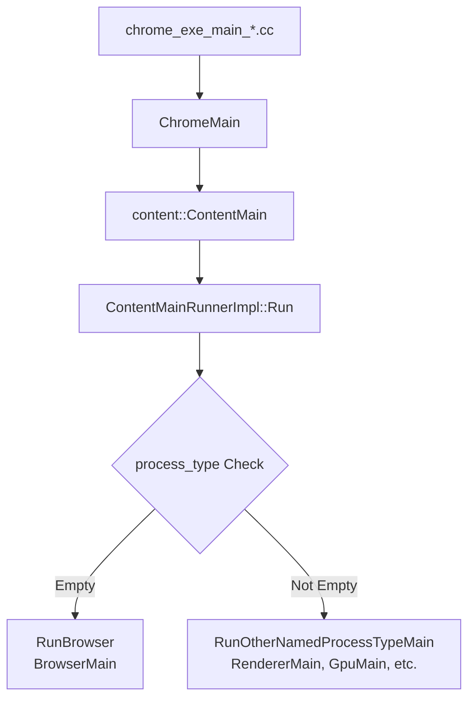
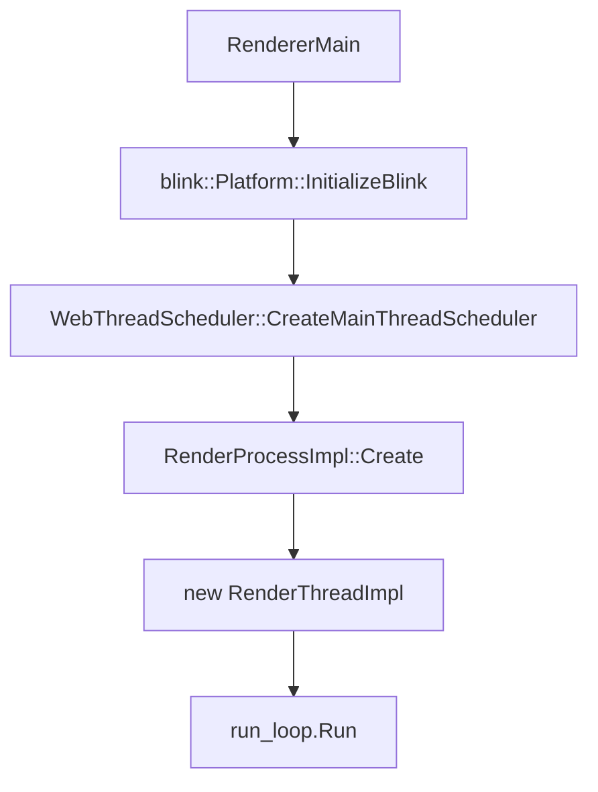

## はじめに
この記事は、「[🎅GMOペパボ エンジニア Advent Calendar 2025](https://adventar.org/calendars/11929)」の17日目の記事です。

もう一年以上前になりますが、Chromium を題材にレンダリングに対する理解を深めようとする記事「[🖼️ レンダリングを探訪する](https://zenn.dev/yoshikouki/explore-rendering)」を投稿しました。この記事では、その内容からもう少し踏み込み、「Chromium を題材にブラウザがどのように開発されているのか」への理解を深めようと、Chromium のリポジトリとソースコードの触りをざっくりと理解していきます。


## Chromium リポジトリの概要
<!-- TODO: 概要とリポジトリのリンクを貼る -->
Chromium は
https://chromium.googlesource.com/

<!-- TODO: chromium/src の紹介を行う -->

<!-- TODO: 手元のPCにコードを落とす場合は git clone ではなく公式が案内している方法があることとそのリンクを紹介する -->


## Chromium のリポジトリを理解するうえで必要な前提知識
<!-- 
TODO: マルチプロセス (最低限 BroeserProcess, RendererProcess のある程度の説明と GpuProcess, UtilityProcess の存在を紹介)
[Multi-process Architecture](https://www.chromium.org/developers/design-documents/multi-process-architecture/) の紹介
-->

Chromium はマルチプロセス・マルチスレッドで動作します。

複数のプロセスが起動する様子は、macOS におけるアクティビティモニターなどで確認できます。


プロセスのうち、Render Process, Browser Process, GPU Process (Viz Process) が [RenderingNG architecture](https://developer.chrome.com/docs/chromium/renderingng-architecture) で紹介されています。


*[引用: RenderingNG architecture  |  Chromium  |  Chrome for Developers](https://developer.chrome.com/docs/chromium/renderingng-architecture)*

> - Render Process:
>   - 単一のサイトとタブの組み合わせに対して、レンダリング、アニメーション、スクロール、入力ルーティングを行う
>   - 複数プロセスが起動する
> - Browser Process:
>   - ブラウザの UI (アドレスバー、タブタイトル、アイコンを含む) に対して、レンダリング、アニメーション、入力のルーティングを行い、残りのすべての入力を適切な Render Process にルーティングする
>   - プロセスは1つだけ存在する
> - Viz Process:
>   - 複数の Render Process および Browser Process からの合成 (コンポジターフレーム) を集約する
>   - 集約後、GPU を使用してラスタライズと描画を行う
>   - プロセスは1つだけ存在する
> 
> ブラウザウィンドウを例にすると、以下のようになります。
> 
> 
> *Viz Process が GPU Process を担う*
> *[Inside look at modern web browser (part 1)  |  Blog  |  Chrome for Developers](https://developer.chrome.com/blog/inside-browser-part1)*

<!--
TODO: Sandboxing について簡単に解説する
chromium/src/docs/design/sandbox.md を紹介する
-->

各プロセスはマルチスレッドで動き、RendererProcess では Main Thread や Compositor Thread などのスレッドが動いています。聞き覚えのある方もいるのではないでしょうか？


*[RenderingNG architecture  |  Chromium  |  Chrome for Developers](https://developer.chrome.com/docs/chromium/renderingng-architecture) の画像を筆者が加工したもの*

より詳細な図が、Chromium 公式ドキュメントの [Multi-process Architecture](https://www.chromium.org/developers/design-documents/multi-process-architecture/#architectural-overview) で紹介されています。


*引用: [Multi-process Architecture](https://www.chromium.org/developers/design-documents/multi-process-architecture/#architectural-overview)*

Main Thread と Compositor Thread は、それぞれ以下の処理を行います。

- Main thread:
  - HTML、CSS、その他のデータ形式の解析
  - スクリプトの実行
  - レンダリングイベントループ
  - ドキュメントのライフサイクル
  - ヒットテスト
  - スクリプトイベントのディスパッチ
- Compositor thread:
  - 入力イベントの処理
  - ウェブコンテンツのスクロールやアニメーションの実行
  - ウェブコンテンツの最適なレイヤリングの計算
  - 画像のデコード
  - ペイントワークレット
  - ラスタタスクの調整


*左図のステージは、実行される場所が色によって示されています*

<!-- TODO: [🖼️ レンダリングを探訪する](https://zenn.dev/yoshikouki/explore-rendering) も理解に約に立つよということを伝える -->


## Chromium リポジトリの構造
言うまでもありませんが Chromium/src のリポジトリは巨大です。


*[引用: Getting Around the Chromium Source Code Directory Structure](https://www.chromium.org/developers/how-tos/getting-around-the-chrome-source-code/#application-startup)*

- **./cc**: The Chromium compositor implementation.
- **./chrome**: The Chromium browser (see below).
- **./content:** The core code needed for a multi-process sandboxed browser (see below). [More information](https://www.chromium.org/developers/content-module) about why we have separated out this code.
  - **./content/renderer**: Code for the subprocess in each tab. This embeds WebKit and talks to `browser` for I/O.


<!-- 
- **./cc**: The Chromium compositor implementation.
- **./chrome**: The Chromium browser (see below).
- **./components**: directory for components that have the Content Module as the uppermost layer they depend on.
- **./content:** The core code needed for a multi-process sandboxed browser (see below). [More information](https://www.chromium.org/developers/content-module) about why we have separated out this code.
  - **./content/browser**: The backend for the application which handles all I/O and communication with the child processes . This talks to the `renderer` to manage web pages.
  - **./content/common:** Files shared between the multiple processes (i.e. browser and renderer, renderer and plugin, etc...). This is the code specific to Chromium (and not applicable to being in base).
  - **./content/gpu:** Code for the GPU process, which is used for 3D compositing and 3D APIs.
  - **./content/plugin:** Code for running browser plugins in other processes.
  - **./content/ppapi_plugin:** Code for the [Pepper](https://www.chromium.org/developers/design-documents/pepper-plugin-implementation) plugin process.
  - **./content/renderer**: Code for the subprocess in each tab. This embeds WebKit and talks to `browser` for I/O.
  - **./content/utility:** Code for running random operations in a sandboxed process. The browser process uses it when it wants to run an operation on untrusted data.
  - **./content/worker:** Code for running HTML5 Web Workers.
- **./third_party**: 200+ small and large "external" libraries such as image decoders, compression libraries and the web engine Blink (here because it inherits license limitations from WebKit). [Adding new packages](https://www.chromium.org/developers/adding-3rd-party-libraries).
    - **.../blink/renderer**: The web engine responsible for turning HTML, CSS and scripts into paint commands and other state changes.
- **./v8**: The V8 Javascript library. This is pulled directly from Google Code's Subversion repository.

公式ドキュメント [Getting Around the Chromium Source Code Directory Structure](https://www.chromium.org/developers/how-tos/getting-around-the-chrome-source-code/) がリポジトリの全体像を掴むのに役立ちます (少なくとも2017年以降更新されていないので、古い情報として扱う必要はありますが)。

また、Chromium の中で動くマルチプロセスの仕組みを理解するために、公式ドキュメント [Multi-process Architecture](https://www.chromium.org/developers/design-documents/multi-process-architecture/) も参考になります
-->


## ブラウザの起動
Chromium ではなく Chrome の話になりますが、各プラットフォーム毎のエントリーポイントが `./chrome/app/chrome_exe_main*` にあります。

```bash
$ ls -lh ./chrome/app/chrome_exe_main*
-rw-r--r--@ 1 yoshikouki  staff   582B Oct 28 22:52 chrome/app/chrome_exe_main_aura.cc
-rw-r--r--@ 1 yoshikouki  staff   9.3K Oct 28 22:52 chrome/app/chrome_exe_main_mac.cc
-rw-r--r--@ 1 yoshikouki  staff    14K Nov 29 15:10 chrome/app/chrome_exe_main_win.cc
-rw-r--r--@ 1 yoshikouki  staff   707B Oct 28 22:52 chrome/app/chrome_exe_main_win.h
```

これらは、[`ChromeMain()` (`./chrome/app/chrome_main.cc`)](https://source.chromium.org/chromium/chromium/src/+/main:chrome/app/chrome_main.cc) を呼び出し、クロスプラットフォームに対応して初期化などの Chrome プロセスの起動処理を行います。各プラットフォームの処理実体は、 `./chrome/app/chrome_main_*` に存在します。

```bash
$ ls -lh ./chrome/app/chrome_main*
-rw-r--r--@ 1 yoshikouki  staff   6.9K Dec  4 22:13 chrome/app/chrome_main.cc
-rw-r--r--@ 1 yoshikouki  staff    66K Nov 29 15:10 chrome/app/chrome_main_delegate.cc
-rw-r--r--@ 1 yoshikouki  staff   4.0K Oct 28 22:52 chrome/app/chrome_main_delegate.h
-rw-r--r--@ 1 yoshikouki  staff   3.7K Oct 28 22:52 chrome/app/chrome_main_delegate_browsertest.cc
-rw-r--r--@ 1 yoshikouki  staff   3.3K Nov 29 15:10 chrome/app/chrome_main_linux.cc
-rw-r--r--@ 1 yoshikouki  staff   890B Oct 28 22:52 chrome/app/chrome_main_linux.h
-rw-r--r--@ 1 yoshikouki  staff   1.0K Oct 28 22:52 chrome/app/chrome_main_mac.h
-rw-r--r--@ 1 yoshikouki  staff   4.9K Oct 28 22:52 chrome/app/chrome_main_mac.mm
```

`ChromeMain()` の中で Chromium の抽象層である [`content::ContentMain()` (`./content/app/content_main.cc`)](https://source.chromium.org/chromium/chromium/src/+/main:content/app/content_main.cc;l=355-360) が呼ばれ、
```c:content/app/content_main.cc
// This function must be marked with NO_STACK_PROTECTOR or it may crash on
// return, see the --change-stack-guard-on-fork command line flag.
NO_STACK_PROTECTOR int ContentMain(ContentMainParams params) {
  auto runner = ContentMainRunner::Create();
  return RunContentProcess(std::move(params), runner.get());
}
```

[`./content/app/content_main_runner_impl.cc`](https://source.chromium.org/chromium/chromium/src/+/main:content/app/content_main_runner_impl.cc;l=1128-1132) の中で以下の各プロセスを起動します。

- [`BrowserMain()` `./content/browser/browser_main.cc`](https://source.chromium.org/chromium/chromium/src/+/main:content/browser/browser_main.cc)
- [`RendererMain()` `./content/renderer/renderer_main.cc`](https://source.chromium.org/chromium/chromium/src/+/main:content/renderer/renderer_main.cc)
- [`GpuMain()` `./content/gpu/gpu_main.cc`](https://source.chromium.org/chromium/chromium/src/+/main:content/gpu/gpu_main.cc)
- [`UtilityMain()` `./content/utility/utility_main.cc`](https://source.chromium.org/chromium/chromium/src/+/main:content/utility/utility_main.cc)

```c:content/app/content_main_runner_impl.cc:1126-1133
  RegisterMainThreadFactories();

  if (process_type.empty())
    return RunBrowser(std::move(main_params), start_minimal_browser);

  return RunOtherNamedProcessTypeMain(process_type, std::move(main_params),
                                      delegate_);
}
```

```c:content/app/content_main_runner_impl.cc:721-768
  static const auto kMainFunctions = std::to_array<MainFunction>({
      {switches::kUtilityProcess, UtilityMain},
      {switches::kRendererProcess, RendererMain},
      {switches::kGpuProcess, GpuMain},
  });

  // ...省略

  for (const MainFunction& main_function : kMainFunctions) {
    if (process_type == main_function.name) {
      auto exit_code =
          delegate->RunProcess(process_type, std::move(main_function_params));
      if (std::holds_alternative<int>(exit_code)) {
        DCHECK_GE(std::get<int>(exit_code), 0);
        return std::get<int>(exit_code);
      }
      return main_function.function(
          std::move(std::get<MainFunctionParams>(exit_code)));
    }
  }
```

これらの流れをシーケンス図にまとめると以下のようになります。





### Renderer Process の起動
Renderer Process のエントリーポイントは [`content::RendererMain()` (`./content/renderer/renderer_main.cc`)](https://source.chromium.org/chromium/chromium/src/+/main:content/renderer/renderer_main.cc) です。

ここでは、Blink の初期化、スケジューラの作成、そして Renderer ごとのメインスレッドとなる `RenderThreadImpl` の生成とメッセージループの開始が行われます。



#### 主な処理の流れ

1. **Blink の初期化**
   - [`blink::Platform::InitializeBlink()`](https://source.chromium.org/chromium/chromium/src/+/main:content/renderer/renderer_main.cc;l=215) が呼ばれ、Web エンジン Blink の初期化が行われます。

2. **Main Thread Scheduler の作成**
   - [`WebThreadScheduler::CreateMainThreadScheduler()`](https://source.chromium.org/chromium/chromium/src/+/main:content/renderer/renderer_main.cc;l=216-218) で、レンダラープロセスのメインスレッド用のスケジューラが作成されます。これは、JavaScript の実行、HTML の解析、スタイルの計算などを適切なタイミングで行うために重要です。

3. **RenderThreadImpl の生成**
   - [`new RenderThreadImpl(...)`](https://source.chromium.org/chromium/chromium/src/+/main:content/renderer/renderer_main.cc;l=291-292) で、レンダラスレッドの実体である `RenderThreadImpl` オブジェクトが生成されます。
   - コンストラクタ (`./content/renderer/render_thread_impl.cc`) 内では、Browser Process との通信経路 (Mojo) の確立や、GPU チャネルの確立 ([`gpu_->EstablishGpuChannel`](https://source.chromium.org/chromium/chromium/src/+/main:content/renderer/render_thread_impl.cc;l=523-527)) などが行われます。

4. **メッセージループ (RunLoop) の開始**
   - [`run_loop.Run()`](https://source.chromium.org/chromium/chromium/src/+/main:content/renderer/renderer_main.cc;l=366) によってメッセージループが開始され、プロセスはイベント待ちの状態になります。これ以降、IPC メッセージや入力イベント、タイマーイベントなどが処理されていきます。

5. **Sandbox化**
   - 処理の途中で [`platform.EnableSandbox()`](https://source.chromium.org/chromium/chromium/src/+/main:content/renderer/renderer_main.cc;l=302-306) (プラットフォームにより異なる) が呼ばれ、プロセスがサンドボックス化されます。これにより、セキュリティリスクが軽減されます。

`RenderThreadImpl` は、Renderer Process 全体の要となるクラスで、Browser Process や GPU Process とのやり取り、リソースの管理などを統括します。


## おわりに
前作の記事「[レンダリングを探訪する](https://zenn.dev/pepabo/articles/explore-rendering)」の続編として、Chromiumのリポジトリを題材に、レンダリングの仕組みを掘り下げてみました。この記事が、Chromium やブラウザ、レンダリングについて詳しく知りたいと思うきっかけとなり、案内役としてお役立ていただけたなら幸いです。

Chromium に対するコントリビュートに興味をお持ちの方は、jxck さんの記事がおすすめです
https://blog.jxck.io/entries/2024-03-26/chromium-contribution.html

最後までお読みいただき、ありがとうございました。
明日の [🎅GMOペパボ エンジニア Advent Calendar 2025](https://adventar.org/calendars/11929) は、[Kentaro Kuribayashi (あんちぽ)](https://kentarokuribayashi.com/) さんです！乞うご期待！

