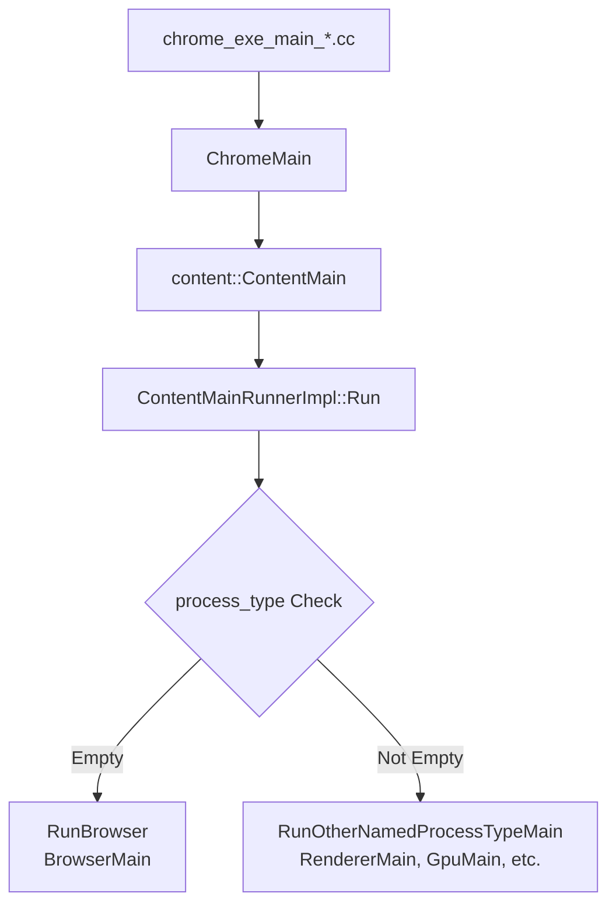

## はじめに
もう一年以上前になりますが、Chromium を題材にレンダリングに対する理解を深めようとする記事「[🖼️ レンダリングを探訪する](https://zenn.dev/yoshikouki/articles/explore-rendering)」を投稿しました。この記事では、その内容からもう少し踏み込み、Chromium を題材に「ブラウザを動かしているコード」への理解を深めたいと思い、Chromium のリポジトリとソースコードの触りをざっくりと理解していきます。

この記事は、「[🎅GMOペパボ エンジニア Advent Calendar 2025](https://adventar.org/calendars/11929)」の17日目の記事です。

## Chromium リポジトリの概要
[Chromium](https://www.chromium.org/chromium-projects/) は、オープンソースのブラウザプロジェクトです。Googleが開発している Chrome だけでなく、Microsoft Edge、Samsung Internet、Arc、Android WebView、Vivaldi、Brave、Opera など、多くのブラウザが Chromium をベースに作られています。

Chromium のコードは https://source.chromium.org/chromium/chromium/src で確認・検索できます。

コードをPCに落としたい場合は、公式の手順を参考にしてください。
https://www.chromium.org/developers/how-tos/get-the-code/

ただしダウンロードサイズが大きいこと、そのため時間がかかること、ビルドまでやろうとするとさらに時間がかかることに留意してください

:::message
本記事で参照しているソースコードは、2025年12月4日時点のコミット [`5f0738f9fc2a`](https://source.chromium.org/chromium/chromium/src/+/5f0738f9fc2a21bcc8f5b411efb9af26cc5862cc:) に基づいています。Chromium は活発に開発されているため、最新のコードでは行番号やファイル構成が変わっている可能性があります。
:::

## Chromium を理解するうえで必要な前提知識
Chromium はマルチプロセス・マルチスレッドで動作します。

プロセスのうち、Renderer Process, Browser Process, GPU Process が複数の公式ドキュメントで紹介されています。


*[引用: RenderingNG architecture  |  Chromium  |  Chrome for Developers](https://developer.chrome.com/docs/chromium/renderingng-architecture)*


*[引用: Inside look at modern web browser (part 1)  |  Blog  |  Chrome for Developers](https://developer.chrome.com/blog/inside-browser-part1)*


*[引用: Inside look at modern web browser (part 1)  |  Blog  |  Chrome for Developers](https://developer.chrome.com/blog/inside-browser-part1)*

1. Browser Process
    - アドレスバー、ブックマーク、戻るボタン、進むボタンなど、「Chrome アプリケーション」の部分を制御します
    - また、ネットワーク リクエストやファイル アクセスなど、ウェブブラウザの不可視の特権部分も処理します
    - プロセスは1つだけ存在します
2. Renderer Process
    - ウェブサイトが表示されているタブ内のすべての要素を制御します
    - 他のサイトとは分離されてプロセスが起動し、サンドボックス化されています
3. GPU Process
    - 他のプロセスから分離して GPU タスクを処理します
    - Renderer Process・Browser Process からの合成 (コンポジターフレーム) を集約し、GPU を使用して描画を行います
    - プロセスは1つだけ存在します


各プロセスはマルチスレッドで動いており、Renderer Process に存在する Main Thread や Compositor Thread、Web Worker は聞き覚えのある方もいるのではないでしょうか？


*[RenderingNG architecture  |  Chromium  |  Chrome for Developers](https://developer.chrome.com/docs/chromium/renderingng-architecture) の画像を筆者が加工したもの*

古い情報にはなりますが、より詳細な関係性が Chromium のデザインドキュメント [Multi-process Architecture](https://www.chromium.org/developers/design-documents/multi-process-architecture/#architectural-overview) で紹介されています。この図では、Renderer Process に対応する Renderer Process Host が Browser Process 内に存在すること、各プロセス間は IPC (Inter-Process Communication。最近では `Mojo` という抽象) で通信していることが示されています。


*引用: [Multi-process Architecture](https://www.chromium.org/developers/design-documents/multi-process-architecture/#architectural-overview)*

特に Renderer Process がマルチプロセスで動くこと、状況によって変わりますが登録可能ドメイン (ドメイン foo.example.com の "example.com" に当たる部分) につき1つの Renderer Process が起動することは押さえておきましょう。この理由は、ブラウザやWebページのセキュリティ・速度・安定性を向上させるため (特にセキュリティ) です。より詳しく知りたい場合は、["Site Isolation"](https://www.chromium.org/developers/design-documents/site-isolation/) や ["Sandbox"](https://chromium.googlesource.com/chromium/src/+/HEAD/docs/design/sandbox.md) などのキーワード、["Spectre" の歴史](https://security.googleblog.com/2018/01/todays-cpu-vulnerability-what-you-need.html)を調べてみると良いでしょう。

Renderer Process は一つの Main Thread と Compositor Thread を持ちます。これらのスレッドがレンダリングパイプラインで担う役割については、前作「[レンダリングを探訪する](https://zenn.dev/yoshikouki/articles/explore-rendering)」で紹介しておりますので、是非ご参照ください。

また、レンダリングパイプラインの各ステージについて詳しく知りたいかたは、[スライド Life of a Pixel](https://docs.google.com/presentation/d/1boPxbgNrTU0ddsc144rcXayGA_WF53k96imRH8Mp34Y) や [Chromium RenderingNG](https://developer.chrome.com/docs/chromium/renderingng?hl=ja) がおすすめです ([Chrome University の動画はこちら](https://www.youtube.com/watch?v=m-J-tbAlFic))。


*引用: [How Blink works](https://docs.google.com/document/u/0/d/1aitSOucL0VHZa9Z2vbRJSyAIsAz24kX8LFByQ5xQnUg/mobilebasic)*


*左図のステージは、実行される場所が色によって示されています*

Chromium 由来のブラウザで複数のプロセスが起動する様子は、macOS におけるアクティビティモニターなどで確認できます。


## Chromium リポジトリの構造
ここからは、Chromium/src リポジトリの構造をざっくりと概観し、前節で紹介した各プロセスがどのディレクトリに対応しているのかを見ていきます。

### Chromium ソースツリーの構造

Chromium のソースコードは、役割に応じて以下の3つの層に分かれています。

#### 1. Core Application Logic（コアアプリケーション層）

| ディレクトリ | 役割 |
|------------|------|
| [./chrome](https://source.chromium.org/chromium/chromium/src/+/main:chrome/) | Chrome ブラウザアプリケーション本体。UI、ブラウザ固有の機能、アプリケーションロジックを含みます |
| [./components](https://source.chromium.org/chromium/chromium/src/+/main:components/) | 再利用可能なモジュール群（autofill、bookmarks、signin、policy など）。`./content` の上に構築され、相互依存を最小限に抑えた設計になっています |

#### 2. Core Abstraction Layers（コア抽象層）

| ディレクトリ | 役割 |
|------------|------|
| [./content](https://source.chromium.org/chromium/chromium/src/+/main:content/) | マルチプロセス・サンドボックス化レンダリングエンジンの抽象層。ほとんどの機能は Content API の上に構築されます。`./chrome` の下層に位置します |
| [./third_party/blink](https://source.chromium.org/chromium/chromium/src/+/main:third_party/blink/) | Blink レンダリングエンジン。オープンな Web プラットフォーム（DOM、CSS、JavaScript API など）を実装。サンドボックス化された Renderer Process 内で動作します |

#### 3. Foundational Libraries（基盤ライブラリ層）

| ディレクトリ | 役割 |
|------------|------|
| [./base](https://source.chromium.org/chromium/chromium/src/+/main:base/) | Chromium の基盤となる構成要素。C++ のユーティリティ、データ構造、スレッディングプリミティブ（`base::Callback`、`base::TaskRunner`）、プラットフォーム抽象化を提供。ほとんどのコードが `./base` に依存します |
| [./net](https://source.chromium.org/chromium/chromium/src/+/main:net/) | ネットワークスタック。HTTP から QUIC まですべてを実装し、ネットワークリクエストの抽象化を提供します |
| [./mojo](https://source.chromium.org/chromium/chromium/src/+/main:mojo/) | プロセス間通信（IPC）のためのコアライブラリ。プロセスやサービス間の通信に使用されます |
| [./services](https://source.chromium.org/chromium/chromium/src/+/main:services/) | 独立したサービスのコレクション。多くは専用のプロセスで動作し、Mojo インターフェースを介して通信します |
| [./v8](https://source.chromium.org/chromium/chromium/src/+/main:v8/) | JavaScript エンジン V8。JavaScript の実行環境を提供し、Blink から使用されます |

#### 4. UI Toolkits（UI ツールキット）

| ディレクトリ | 役割 |
|------------|------|
| [./ui](https://source.chromium.org/chromium/chromium/src/+/main:ui/) | ユーザーインターフェース構築のための基盤ツールキット |
| [./ui/views](https://source.chromium.org/chromium/chromium/src/+/main:ui/views/) | クロスプラットフォームなデスクトップ UI（Windows、Linux、ChromeOS）を構築するための主要フレームワーク。ウィジェットベースのシステムでネイティブな操作感のインターフェースを実現します |

これらの構造を図示すると以下のようになります。


*[引用: How Blink works](https://docs.google.com/document/u/0/d/1aitSOucL0VHZa9Z2vbRJSyAIsAz24kX8LFByQ5xQnUg/mobilebasic)*


#### 主要ディレクトリとプロセスの対応

前のセクションで紹介したマルチプロセスアーキテクチャは、以下のようにディレクトリに対応しています。

| プロセス | 主要ディレクトリ |
|---------|-----------------|
| Browser Process | [./content/browser](https://source.chromium.org/chromium/chromium/src/+/main:content/browser/) |
| Renderer Process | [./content/renderer](https://source.chromium.org/chromium/chromium/src/+/main:content/renderer/), [./third_party/blink/renderer](https://source.chromium.org/chromium/chromium/src/+/main:third_party/blink/renderer/) |
| Renderer Process (Compositor Thread) | [./cc](https://source.chromium.org/chromium/chromium/src/+/main:cc/) |
| GPU Process | [./content/gpu](https://source.chromium.org/chromium/chromium/src/+/main:content/gpu/) |


### レンダリングエンジン Blink
Blink は `./third_party/blink/renderer` に配置されており、HTML、CSS、JavaScript を解析してレンダリング命令に変換する役割を担います。

```
./third_party/blink/renderer/
├── controller/ # 下位の core/ や modules/ を使用するライブラリ。呼び出し元となる
├── core/       # DOM、HTML、CSS など Web Platform の核心機能。DOM と密接に結びついた機能を実装
├── modules/    # Web Audio, IndexedDB, WebGL、WebCrypto など自己完結した Web API
├── platform/   # 低レベル機能（タスクスケジューラ、グラフィックス等）
└── bindings/   # Web API を V8 (JavaScript) から利用可能にするラッパー層
```

これらのディレクトリには[厳密な依存関係のルール](https://source.chromium.org/chromium/chromium/src/+/main:third_party/blink/renderer/README.md)があり、Chromium -> `controller/` -> `modules/` -> `core/` -> `platform/` -> 低レベル機能の方向にのみ依存できます。


*[引用: How Blink works](https://docs.google.com/document/u/0/d/1aitSOucL0VHZa9Z2vbRJSyAIsAz24kX8LFByQ5xQnUg/mobilebasic)*

#### レンダリングパイプラインとの対応

前作「[レンダリングを探訪する](https://zenn.dev/yoshikouki/articles/explore-rendering)」で紹介したレンダリングパイプラインの各ステージは、Blink の以下のディレクトリで実装されています。

| ステージ | ディレクトリ |
|---------|-------------|
| Parse | `core/html/parser/`, `core/css/parser/` |
| Style | `core/css/`, `core/style/` |
| Layout | `core/layout/` |
| Paint | `core/paint/` |
| Composite | `./cc`（Blink 外） |

※ `core/` = `./third_party/blink/renderer/core/`


Blink（Main Thread）で Parse から Paint までを処理し、その後 Compositor Thread（`./cc`）でレイヤーの合成が行われ、最終的に GPU Process（Viz）で画面に描画されます。


## ブラウザの起動
ここからは、具体的な処理において、Chromium リポジトリ内のどの部分が関与しているのかを見ていきます。まずは、Chromium ベースのブラウザが起動する際の流れを追いかけてみましょう。
Chromium ではなく Chrome の話になりますが、各プラットフォーム毎のエントリーポイントは `./chrome/app/chrome_exe_main*` に存在します。

```bash
$ ls -lh ./chrome/app/chrome_exe_main*
-rw-r--r--@ 1 yoshikouki  staff   582B Oct 28 22:52 chrome/app/chrome_exe_main_aura.cc
-rw-r--r--@ 1 yoshikouki  staff   9.3K Oct 28 22:52 chrome/app/chrome_exe_main_mac.cc
-rw-r--r--@ 1 yoshikouki  staff    14K Nov 29 15:10 chrome/app/chrome_exe_main_win.cc
-rw-r--r--@ 1 yoshikouki  staff   707B Oct 28 22:52 chrome/app/chrome_exe_main_win.h
```

これらは、[`ChromeMain()` (`./chrome/app/chrome_main.cc`)](https://source.chromium.org/chromium/chromium/src/+/main:chrome/app/chrome_main.cc) を呼び出し、クロスプラットフォームに対応して初期化などの Chrome プロセスの起動処理を行います。各プラットフォームの処理実体は、 `./chrome/app/chrome_main_*` に存在します。

```bash
$ ls -lh ./chrome/app/chrome_main*
-rw-r--r--@ 1 yoshikouki  staff   6.9K Dec  4 22:13 chrome/app/chrome_main.cc
-rw-r--r--@ 1 yoshikouki  staff    66K Nov 29 15:10 chrome/app/chrome_main_delegate.cc
-rw-r--r--@ 1 yoshikouki  staff   4.0K Oct 28 22:52 chrome/app/chrome_main_delegate.h
-rw-r--r--@ 1 yoshikouki  staff   3.7K Oct 28 22:52 chrome/app/chrome_main_delegate_browsertest.cc
-rw-r--r--@ 1 yoshikouki  staff   3.3K Nov 29 15:10 chrome/app/chrome_main_linux.cc
-rw-r--r--@ 1 yoshikouki  staff   890B Oct 28 22:52 chrome/app/chrome_main_linux.h
-rw-r--r--@ 1 yoshikouki  staff   1.0K Oct 28 22:52 chrome/app/chrome_main_mac.h
-rw-r--r--@ 1 yoshikouki  staff   4.9K Oct 28 22:52 chrome/app/chrome_main_mac.mm
```

`ChromeMain()` の中で Chromium の抽象層である [`content::ContentMain()` (`./content/app/content_main.cc`)](https://source.chromium.org/chromium/chromium/src/+/main:content/app/content_main.cc;l=355-360) が呼ばれ、
```cpp:content/app/content_main.cc
// This function must be marked with NO_STACK_PROTECTOR or it may crash on
// return, see the --change-stack-guard-on-fork command line flag.
NO_STACK_PROTECTOR int ContentMain(ContentMainParams params) {
  auto runner = ContentMainRunner::Create();
  return RunContentProcess(std::move(params), runner.get());
}
```

[`./content/app/content_main_runner_impl.cc`](https://source.chromium.org/chromium/chromium/src/+/main:content/app/content_main_runner_impl.cc;l=1128-1132) の中で以下の各プロセスを起動します。

- [`BrowserMain()` `./content/browser/browser_main.cc`](https://source.chromium.org/chromium/chromium/src/+/main:content/browser/browser_main.cc)
- [`RendererMain()` `./content/renderer/renderer_main.cc`](https://source.chromium.org/chromium/chromium/src/+/main:content/renderer/renderer_main.cc)
- [`GpuMain()` `./content/gpu/gpu_main.cc`](https://source.chromium.org/chromium/chromium/src/+/main:content/gpu/gpu_main.cc)
- [`UtilityMain()` `./content/utility/utility_main.cc`](https://source.chromium.org/chromium/chromium/src/+/main:content/utility/utility_main.cc)

```cpp:content/app/content_main_runner_impl.cc:1126-1133
  RegisterMainThreadFactories();

  if (process_type.empty())
    return RunBrowser(std::move(main_params), start_minimal_browser);

  return RunOtherNamedProcessTypeMain(process_type, std::move(main_params),
                                      delegate_);
}
```

```cpp:content/app/content_main_runner_impl.cc:721-768
  static const auto kMainFunctions = std::to_array<MainFunction>({
      {switches::kUtilityProcess, UtilityMain},
      {switches::kRendererProcess, RendererMain},
      {switches::kGpuProcess, GpuMain},
  });

  // ...省略

  for (const MainFunction& main_function : kMainFunctions) {
    if (process_type == main_function.name) {
      auto exit_code =
          delegate->RunProcess(process_type, std::move(main_function_params));
      if (std::holds_alternative<int>(exit_code)) {
        DCHECK_GE(std::get<int>(exit_code), 0);
        return std::get<int>(exit_code);
      }
      return main_function.function(
          std::move(std::get<MainFunctionParams>(exit_code)));
    }
  }
```

これらの流れをシーケンス図にまとめると以下のようになります。





### Renderer Process の起動

Renderer Process 関連の主要ファイルは以下の通りです。

```bash
$ ls -lh ./content/renderer/renderer_main.cc ./content/renderer/render_thread_impl.cc ./content/renderer/render_thread_impl.h ./content/renderer/render_process_impl.cc
-rw-r--r--@ 1 yoshikouki  staff   8.3K Oct 28 22:52 ./content/renderer/render_process_impl.cc
-rw-r--r--@ 1 yoshikouki  staff    63K Nov 29 15:10 ./content/renderer/render_thread_impl.cc
-rw-r--r--@ 1 yoshikouki  staff    23K Nov 29 15:10 ./content/renderer/render_thread_impl.h
-rw-r--r--@ 1 yoshikouki  staff    14K Nov 29 15:10 ./content/renderer/renderer_main.cc
```

Renderer Process のエントリーポイントは [`content::RendererMain()` (`./content/renderer/renderer_main.cc`)](https://source.chromium.org/chromium/chromium/src/+/main:content/renderer/renderer_main.cc) です。

ここでは、Blink の初期化、スケジューラの作成、そして Renderer ごとのメインスレッドとなる `RenderThreadImpl` の生成とメッセージループの開始が行われます。

#### 主な処理の流れ

**1. Blink の初期化とスケジューラの作成**

```cpp:content/renderer/renderer_main.cc:215-218
  blink::Platform::InitializeBlink();
  std::unique_ptr<blink::scheduler::WebThreadScheduler> main_thread_scheduler =
      blink::scheduler::WebThreadScheduler::CreateMainThreadScheduler(
          CreateMainThreadMessagePump());
```

[`blink::Platform::InitializeBlink()`](https://source.chromium.org/chromium/chromium/src/+/main:content/renderer/renderer_main.cc;l=215) が呼ばれ、Web エンジン Blink の初期化が行われます。続いて [`WebThreadScheduler::CreateMainThreadScheduler()`](https://source.chromium.org/chromium/chromium/src/+/main:content/renderer/renderer_main.cc;l=216-218) で、レンダラープロセスのメインスレッド用のスケジューラが作成されます。これは、JavaScript の実行、HTML の解析、スタイルの計算などを適切なタイミングで行うために重要です。

**2. RenderProcess と RenderThreadImpl の生成**

```cpp:content/renderer/renderer_main.cc:287-292
    std::unique_ptr<RenderProcess> render_process = RenderProcessImpl::Create();
    // It's not a memory leak since RenderThread has the same lifetime
    // as a renderer process.
    base::RunLoop run_loop;
    new RenderThreadImpl(run_loop.QuitClosure(),
                         std::move(main_thread_scheduler));
```

[`RenderProcessImpl::Create()`](https://source.chromium.org/chromium/chromium/src/+/main:content/renderer/renderer_main.cc;l=287) で RenderProcess が生成され、続いて [`new RenderThreadImpl(...)`](https://source.chromium.org/chromium/chromium/src/+/main:content/renderer/renderer_main.cc;l=291-292) でレンダラスレッドの実体である `RenderThreadImpl` オブジェクトが生成されます。

**3. GPU チャネルの確立**

`RenderThreadImpl` のコンストラクタ内では、GPU Process との通信経路が確立されます。

```cpp:content/renderer/render_thread_impl.cc:518-527
  gpu_ = viz::Gpu::Create(std::move(remote_gpu), GetIOTaskRunner());

  // Establish the GPU channel now, so its ready when needed and we don't have
  // to wait on a sync call.
  if (base::FeatureList::IsEnabled(features::kEarlyEstablishGpuChannel)) {
    gpu_->EstablishGpuChannel(
        base::BindOnce([](scoped_refptr<gpu::GpuChannelHost> host) {
          if (host)
            GetContentClient()->SetGpuInfo(host->gpu_info());
        }));
  }
```

**4. Sandbox化**

処理の途中で [`platform.EnableSandbox()`](https://source.chromium.org/chromium/chromium/src/+/main:content/renderer/renderer_main.cc;l=250) (プラットフォームにより異なる) が呼ばれ、プロセスがサンドボックス化されます。これにより、セキュリティリスクが軽減されます。

```cpp:content/renderer/renderer_main.cc:320-325
    if (need_sandbox) {
      should_run_loop = platform.EnableSandbox();
      if (client) {
        client->PostSandboxInitialized();
      }
    }
```

**5. メッセージループ (RunLoop) の開始**

```cpp:content/renderer/renderer_main.cc:356-367
    if (should_run_loop) {
#if BUILDFLAG(IS_MAC)
      if (pool)
        pool->Recycle();
#endif
      TRACE_EVENT_INSTANT0("toplevel", "RendererMain.START_MSG_LOOP",
                           TRACE_EVENT_SCOPE_THREAD);
      const base::TimeTicks run_loop_start_time = base::TimeTicks::Now();
      RenderThreadImpl::current()->set_run_loop_start_time(run_loop_start_time);
      LogTimeToStartRunLoop(command_line, run_loop_start_time);
      run_loop.Run();
    }
```

[`run_loop.Run()`](https://source.chromium.org/chromium/chromium/src/+/main:content/renderer/renderer_main.cc;l=366) によってメッセージループが開始され、プロセスはイベント待ちの状態になります。これ以降、IPC メッセージや入力イベント、タイマーイベントなどが処理されていきます。

`RenderThreadImpl` は、Renderer Process 全体の要となるクラスで、Browser Process や GPU Process とのやり取り、リソースの管理などを統括します。


## おわりに
この記事では、前作「[レンダリングを探訪する](https://zenn.dev/pepabo/articles/explore-rendering)」の続編として、Chromiumのリポジトリを題材に、レンダリングの仕組みを掘り下げてみました。

Chromium/src のリポジトリは巨大です。世界最大級のオープンソースプロジェクトの一つとも言えるのではないでしょうか。私自身、Web アプリケーションエンジニアとしても一般利用者としても Chrome ブラウザや V8 にお世話になっておりますが、以前からその仕組みについて興味がありました。今回、その興味のままリポジトリの中身を覗いてみたのですが、正直なかなか理解が難しい部分が多かったです。

ブラウザという、多くの一般利用者の持つ端末上に存在する仮想OSのような存在について、Unknown Unknowns（未知の未知）の領域が想像していた以上に広大なことに驚きました。一方、少しでも Known Unknowns（知られている未知）になった部分もあり、特に Chromium における登場人物や役割、レンダリングパイプラインとの対応関係など、以前よりも理解が深まったと感じています。

この記事が、Chromium やブラウザ、レンダリングについて詳しく知りたいと思うきっかけとなり、案内役としてお役立ていただけたなら幸いです。発展して、Chromium に対するコントリビュートに興味をお持ちの方は、jxck さんの記事がおすすめですので紹介します。
https://blog.jxck.io/entries/2024-03-26/chromium-contribution.html

最後までお読みいただき、ありがとうございました。
明日の [🎅GMOペパボ エンジニア Advent Calendar 2025](https://adventar.org/calendars/11929) は、[Kentaro Kuribayashi (あんちぽ)](https://kentarokuribayashi.com/) さんです！乞うご期待！


## リンク集・参考資料
引用したリンクに限らず、記事内では紹介しきれなかった参考資料を以下にまとめます。

1.  [Getting Around the Chromium Source Code Directory Structure](https://www.chromium.org/developers/how-tos/getting-around-the-chrome-source-code/)
    - リポジトリ全体像を掴むのに役立ちます（少なくとも2017年以降は更新されていないので、古い情報として読む必要はあります）
2. [Get the Code: Checkout, Build, & Run Chromium](https://www.chromium.org/developers/how-tos/get-the-code/)
    - chromium/src リポジトリの OS 別のダウンロード手順
3. [How Blink works](https://docs.google.com/document/u/0/d/1aitSOucL0VHZa9Z2vbRJSyAIsAz24kX8LFByQ5xQnUg/mobilebasic)
    - Blink の公式ドキュメント。ある程度詳しく新し目の解説があります。レンダリングを理解したいなら必読です
4. [Multi-process Architecture](https://www.chromium.org/developers/design-documents/multi-process-architecture/#architectural-overview)
    - 公式ドキュメント。アーキテクチャの目的や背景に関する説明があります
5. [How Chromium Displays Web Pages](https://www.chromium.org/developers/design-documents/displaying-a-web-page-in-chrome/)
    - 公式ドキュメント。情報が古いので参考までに
6. [source_tree_overview.md - Chromium Code Search](https://source.chromium.org/chromium/chromium/src/+/main:docs/source_tree_overview.md;l=1;bpv=1;bpt=0)
    - コード上のドキュメント。本当にざっくりとしたソースコードのディレクトリ概要が載っています
7. [startup.md - Chromium Code Search](https://source.chromium.org/chromium/chromium/src/+/main:docs/design/startup.md;l=1)
    - コード上のドキュメント。ざっくりと Chrome の起動について解説されています。
8. [README.md - Chromium Code Search](https://source.chromium.org/chromium/chromium/src/+/main:third_party/blink/renderer/README.md)
    - Blink レンダリングエンジンの README。概要と依存関係について解説しています
9. [最新のウェブブラウザの詳細（パート 1）  |  Blog  |  Chrome for Developers](https://developer.chrome.com/blog/inside-browser-part1?hl=ja)
    - CPU、メモリ、プロセスなどからブラウザの基本的な仕組みまで解説してくれます
10. [RenderingNG  |  Chromium  |  Chrome for Developers](https://developer.chrome.com/docs/chromium/renderingng?hl=ja)
    - Chromium の次世代レンダリングアーキテクチャについて解説しています
11. [Life of a Pixel - Google スライド](https://docs.google.com/presentation/d/1boPxbgNrTU0ddsc144rcXayGA_WF53k96imRH8Mp34Y)
    - レンダリングパイプラインの各ステージについて、詳しく解説しています
12. [Site Isolation Design Document](https://www.chromium.org/developers/design-documents/site-isolation/)
13. [Chromium Docs - Sandbox](https://chromium.googlesource.com/chromium/src/+/HEAD/docs/design/sandbox.md)
14. [Google Online Security Blog: Today's CPU vulnerability: what you need to know](https://security.googleblog.com/2018/01/todays-cpu-vulnerability-what-you-need.html)
15. [🖼️ レンダリングを探訪する](https://zenn.dev/yoshikouki/articles/explore-rendering)
    - 前作。Chromium のレンダリングパイプラインを中心に解説しています
