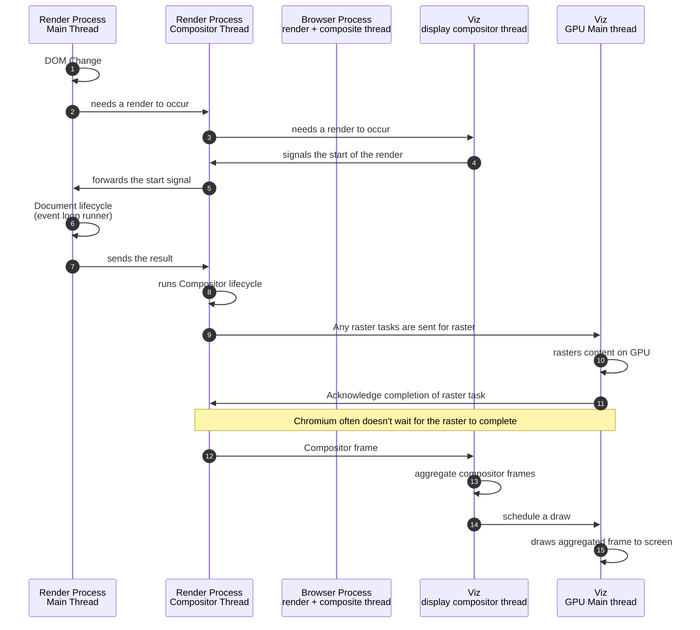
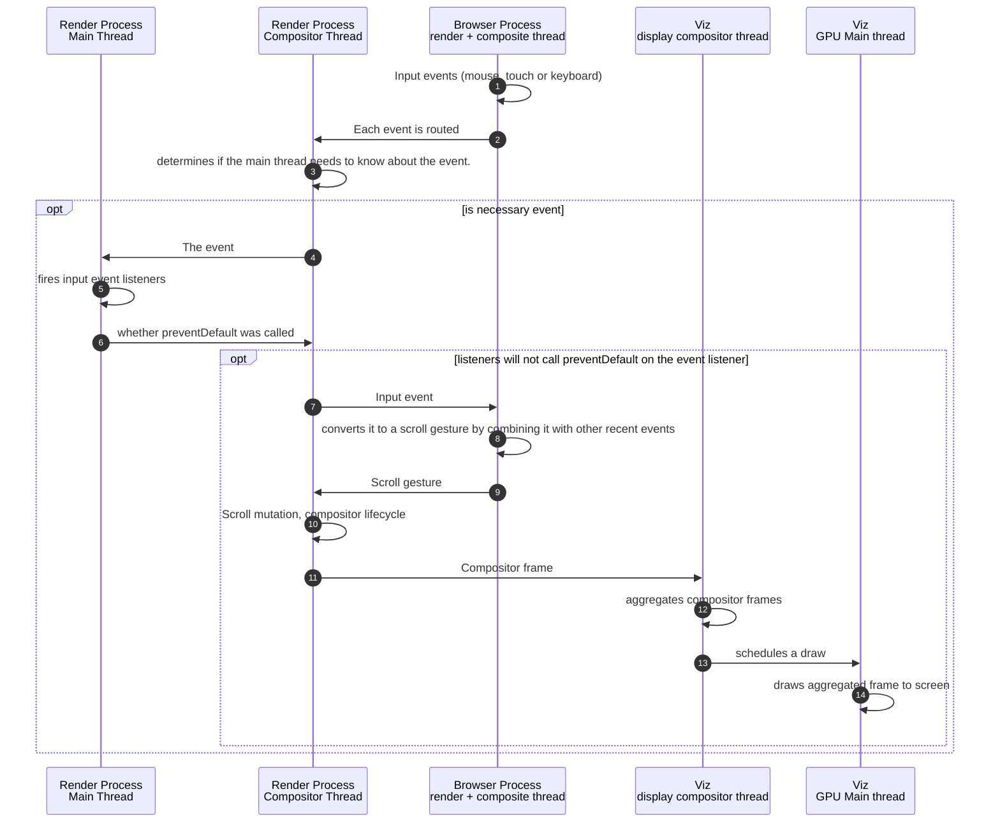

※ 当記事は、[さくらじまハウス 2024 のLT「レンダリングを探訪する」](https://www.sakurajima-house.tech/#section-3) の書き起こしとして作成しました。

LT資料:
https://speakerdeck.com/yoshikouki/rendaringuwotan-fang-suru

## はじめに

この記事では、ブラウザのレンダリングについて掘り下げていきます。Web アプリケーション開発において、パフォーマンスの最適化や複雑なバグの解決は日常的な課題です。ブラウザのレンダリングフローを理解することで、それらの原因をより深く突き止めることができるようになります。

ブラウザと一口に言っても数多く存在しますが、今回は多くのブラウザで採用されている Chromium を題材に、そのレンダリングの仕組みを詳しく見ていきます。Chromium は Google Chrome、Microsoft Edge、Opera などで採用されているため、その仕組みを理解することは Web アプリケーション開発者にとって大きなヒントとなるでしょう。

*※ シェア列は、資料作成時点 2024/10/13 頃の [Mobile Browser Market Share Worldwide | Statcounter Global Stats](https://gs.statcounter.com/browser-market-share/mobile/worldwide) を記載*
*※ 「iOS 系ブラウザ」のシェアは、資料作成時点の [Operating System Market Share Worldwide | Statcounter Global Stats](https://gs.statcounter.com/os-market-share) のシェアを記載*

なお、記事内容は [RenderingNG architecture  |  Chromium  |  Chrome for Developers](https://developer.chrome.com/docs/chromium/renderingng-architecture) の内容をベースにしています。

## ブラウザレンダリング

「レンダリングの流れ」と聞いて、どのような処理の順番を思い浮かべますか？
たとえば以下の4つのフローが示されている場合があります。

1. Parse
2. Style
3. Layout
4. Paint

[ブラウザの仕組み  |  Articles  |  web.dev](https://web.dev/articles/howbrowserswork?hl=ja) では、以下のように WebKit と Gecko のメインフローを紹介しています。

*WebKit のメインフロー*

*Mozilla の Gecko レンダリング エンジンのメインフロー*
*https://web.dev/articles/howbrowserswork?hl=ja#main_flow_examples*

Chromium の場合はどうでしょうか？
[Chromium のプロジェクト RenderingNG のドキュメント](https://developer.chrome.com/docs/chromium/renderingng) では、Chromium のレンダリングフローを紹介しています。

*Chromium のレンダリング*
*https://developer.chrome.com/docs/chromium/renderingng*

Chromium の図において WebKit と Gecko のメインフローに対応するのは、"Main Thread" のフロー (`script` -> `style` -> `layout` -> `paint`) と捉えることもできそうですが、Chromium には Rendering pipeline structure というフローが存在し、Main Thread 以外のフローも重要な役割を担っています。

*Chromium のレンダリングパイプライン*
*https://developer.chrome.com/docs/chromium/renderingng*

しかし、大きく見ると、どのレンダリングエンジンでも似たフローになっていることがわかります。

メインフローについては、[aki @_akimuu_さん](https://x.com/_akimuu_) の記事「[ブラウザレンダリングの仕組み](https://zenn.dev/ak/articles/c28fa3a9ba7edb)」の図がとてもわかりやすいです。メインフローの詳細についても記事内で紹介されていますので、是非ご一読ください。

*https://zenn.dev/ak/articles/c28fa3a9ba7edb*

## レンダリングパイプライン

Chromium のレンダリングパイプラインについて見ていきましょう。

レンダリングパイプラインは、いくつかのステージ Stage と途中で作成される成果物 Artifact で構成されます。

- Stage: レンダリング内で明確に定義された1つのタスクを実行するコード
- Artifact: ステージの入力・出力であるデータ構造

各ステージを実行するのは、Main Thread, Compositor Thread, Viz Process の3つに別れます

*左図のステージは、実行される場所が色によって示されています*

上記の内容と各ステージの概要をまとめたものが次表です。

Stage | Execute | Description
--- | --- | ---
Animate | Main Thread / Compositor Thread | change computed styles and mutate property trees over time based on declarative timelines. 宣言的なタイムラインに基づいて、計算スタイルを変更し、プロパティツリーを随時変化させます
Style | Main Thread | apply CSS to the DOM, and create computed styles. CSS を DOM に適用し、計算スタイルを生成します
Layout | Main Thread | determine the size and position of DOM elements on the screen, and create the immutable fragment tree. DOM 要素の画面上のサイズと位置を決定し、不変のフラグメントツリーを生成します
Pre-paint | Main Thread | compute property trees and invalidate any existing display lists and GPU texture tiles as appropriate. プロパティツリーを計算し、既存のディスプレイリストや GPU テクスチャタイルを適宜無効化します
Scroll | Main Thread | update the scroll offset of documents and scrollable DOM elements, by mutating property trees. プロパティツリーを変化させることで、ドキュメントやスクロール可能な DOM 要素のスクロールオフセットを更新します
Paint | Main Thread | compute a display list that describes how to raster GPU texture tiles from the DOM. DOM から GPU テクスチャタイルをラスタライズする方法を記述するディスプレイリストを計算します
Commit | Main Thread | copy property trees and the display list to the compositor thread. プロパティツリーとディスプレイリストをコンポジタースレッドにコピーします
Layerize | Compositor Thread | break up the display list into a composited layer list for independent rasterization and animation. ディスプレイリストを分割し、独立したラスタライズとアニメーションのために合成レイヤーリストを作成します
Raster Decode Paint worklets | Compositor Thread / Viz Process | turn display lists, encoded images, and paint worklet code, respectively, into GPU texture tiles. ディスプレイリスト、エンコードされた画像、ペイントワークレットコードをそれぞれ GPU テクスチャタイルに変換します
Activate | Compositor Thread | create a compositor frame representing how to draw and position GPU tiles to the screen, together with any visual effects. GPU タイルを画面に描画・配置する方法を示すコンポジターフレームを、ビジュアルエフェクトとともに生成します
Aggregate | Viz Process | combine compositor frames from all the visible compositor frames into a single, global compositor frame. すべての可視コンポジターフレームを1つのグローバルなコンポジターフレームに統合します
Draw | Viz Process | execute the aggregated compositor frame on the GPU to create pixels on-screen. 集約されたコンポジターフレームを GPU 上で実行し、画面上にピクセルを描画します

*[RenderingNG architecture  |  Chromium  |  Chrome for Developers](https://developer.chrome.com/docs/chromium/renderingng-architecture) より筆者が作表。和訳は ChatGPT O1-preview によるもの*

この節では Chromium におけるレンダリングの流れを見てきましたが、WebKit や Gecko と似たフローとはいえ、WebKit や Gecko における "Painting" から "Display" までの処理が分厚いことがわかります。また、Chromium がマルチプロセスや GPU を利用することで、処理を分散させていることもわかりました。

ここからは、説明もなく登場した Main Thread, Compositor Thread, Viz Process の役割を見ていきましょう。

## プロセスとスレッド

Chromium はマルチプロセス・マルチスレッドで動作します。そのプロセスのうち、Render Process, Browser Process, Viz Process が [RenderingNG architecture](https://developer.chrome.com/docs/chromium/renderingng-architecture) で紹介されています。

*[RenderingNG architecture  |  Chromium  |  Chrome for Developers](https://developer.chrome.com/docs/chromium/renderingng-architecture)*

- Render Process:
  - 単一のサイトとタブの組み合わせに対して、レンダリング、アニメーション、スクロール、入力ルーティングを行う
  - 複数プロセスが起動する
- Browser Process:
  - ブラウザの UI (アドレスバー、タブタイトル、アイコンを含む) に対して、レンダリング、アニメーション、入力のルーティングを行い、残りのすべての入力を適切な Render Process にルーティングする
  - プロセスは1つだけ存在する
- Viz Process:
  - 複数の Render Process および Browser Process からの合成 (コンポジターフレーム) を集約する
  - 集約後、GPU を使用してラスタライズと描画を行う
  - プロセスは1つだけ存在する

ブラウザウィンドウを例にすると、以下のようになります。

*Viz Process が GPU Process を担う*
*[Inside look at modern web browser (part 1)  |  Blog  |  Chrome for Developers](https://developer.chrome.com/blog/inside-browser-part1)*

複数の Render Process が起動する様子は、macOS におけるアクティビティモニターなどで確認できます。

レンダリングパイプラインで登場した Main Thread と Compositor Thread は、Render Process で動作します。もちろん、Browser Process や Viz Process にもそれぞれの役割を果たすスレッドが存在します。

Main Thread と Compositor Thread は以下の処理を行います。

- Main thread:
  - HTML、CSS、その他のデータ形式の解析
  - スクリプトの実行
  - レンダリングイベントループ
  - ドキュメントのライフサイクル
  - ヒットテスト
  - スクリプトイベントのディスパッチ
- Compositor thread:
  - 入力イベントの処理
  - ウェブコンテンツのスクロールやアニメーションの実行
  - ウェブコンテンツの最適なレイヤリングの計算
  - 画像のデコード
  - ペイントワークレット
  - ラスタタスクの調整

*[RenderingNG architecture  |  Chromium  |  Chrome for Developers](https://developer.chrome.com/docs/chromium/renderingng-architecture) の画像を筆者が加工したもの*

上図においても表現されていますが、Main Thread と Compositor Thread は各プロセスに対してシングルスレッドで動作します。しかし、それぞれに Thread Helper が存在し、高価な処理は適宜マルチスレッドで動作します。

## 具体的な処理のシーケンス図

大まかな処理の流れや役割を見てきましたが、ここからは具体的な処理のシーケンス図を通して、さらにそれぞれの役割について掴んでいきます。

なお、シーケンス図は [Chromium RenderingNG の Example architecture in practice](https://developer.chrome.com/docs/chromium/renderingng-architecture#example-architecture) を元にしています。詳しい処理内容はそちらをご覧ください。

### DOM更新

はじめに一般的な DOM 更新について見ていきます。

まず、Main Thread で DOM 更新が発生します。その後、 Compositor Thread や Viz Process まで処理が波及し、また Main Thread に戻ってきます。

その後、工程 6 で "Document lifecycle" とありますが、ここでフロントエンドエンジニアにとって馴染みある MutationObserver などのイベントリスナーが発火されます。

そしてまた Compositor Thread や Viz Process に処理が進行し、最終的にDOM更新がスクリーンに描画されます。

ここで注目したいのは、処理の流れは必ずしも Main Thread -> Compositor Thread -> Viz Process と一方通行の流れではないところです。大きく見たらその順番にはなっているのですが、適宜 Compositor Thread や Viz Process に処理が移ったり、その逆の流れが発生します。

また、DOM 更新の処理に GPU (Viz Process GPU Main thread) が関わっている点も注目したいところです。

### スクロール

次にスクロールの流れを見ていきます。

DOM 更新とは打って変わり、まずタッチやキーボードのイベントを Browser Process で受け取っています。そのイベントを適切な Render Process の Compositor Thread に繋げます (Render Process は複数立ち上がっています)。

その後、イベントの必要に応じて Main Thread に処理が移り、登録されたイベントリスナーが発火します。このイベントリスナーで `event.preventDefault()` が実行された場合、処理はここで終わります (正確には `preventDefault` が実行されたことを Compositor Thread に渡して終了です)。

`preventDefault` が実行されない場合、Compositor Thread, Browser Process, Viz Process で後続処理が走ります。

注目したいのは、Browser Process で最初にイベントを受け取るということです。たしかに、Render Process はタブ毎に複数立ち上がっている場合もあるので、ブラウザというソフトウェアへの入力を Browser Process で受け取るのは自然なように思えます。

## おわりに

この記事では、ブラウザのレンダリングについて、Chromium を題材にその仕組みを理解する助けとなるような内容を目指しました。
レンダリングは、複雑な工程が多く絡み合う仕組みですが、特定のプロセスやスレッドごとの役割を知ることで、より正確なパフォーマンスの改善やデバッグが可能になります。

個人的には、そのシステムに幾重の工夫が施されており、とても興味深いです。これからもブラウザの進化とともに、レンダリングの仕組みもより複雑かつ高度になっていくことでしょう。楽しみです。

この記事が、レンダリング技術に触れ、新たな知識を深めるきっかけとなれば幸いです。
最後までお読みいただき、ありがとうございました。
