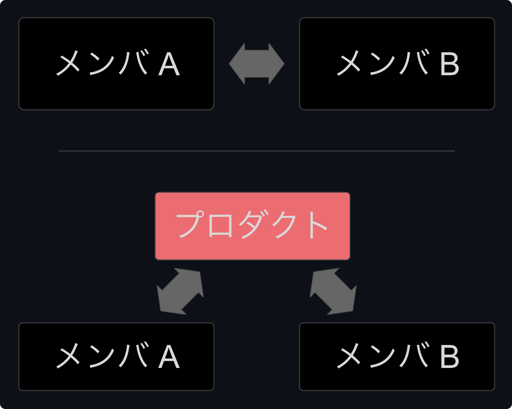

<!-- TailwindCSS を使うための設定 -->

# <!--fit--> ハッカソン手引き

  

    
    

      
yoshikouki

      
GMOペパボ株式会社

    

  

---

# 目次

1. **はじめに**
2. ハッカソンの開発戦略
3. MVP という考え方
4. プレゼンテーションとデモンストレーション
5. まとめ

---

<!-- _header: 1. はじめに -->

## 本講演の目的

- ハッカソンにおける効果的な開発手法を紹介する
- プロダクト開発の始め方・進め方の羅針盤を得る

## 想定対象者

- プロダクトの初期開発の経験が少ない、もしくは興味ある方
- 「MVP」という言葉を聞いて「もっとも活躍した人」を想起する方

---

<!-- _header: 1. はじめに -->

## ハッカソンの定義

- ハッカソン hackathon = ハック hack + マラソン marathon
- Wikipediaより:
  > ソフトウェア開発分野のプログラマやグラフィックデザイナー、ユーザインタフェース設計者、プロジェクトマネージャらが集中的に作業をするソフトウェア関連プロジェクトのイベントである
- 技術スキルを使って、限られた時間内にアイデアを出し合い、新しいプロダクトをチームで作るイベント

---

<!-- _header: 1. はじめに -->

## 本日のゴール

イベント終了時に「**楽しかった！またやりたい！**」と心から思えること

ゴールでは**ない**もの:
- プロダクトを開発しきる
- 「すごいもの」を作る
- 表彰される

---

<!-- _header: 1. はじめに -->

## アイデアの見つけ方

今回は時間の都合で割愛しますが、以下の本がヒントになります

- 『アイデアのつくり方』
- 『コンセプト・センス 正解のない時代の答えのつくりかた』

---

# 目次

1. ~~はじめに~~
2. **ハッカソンの開発戦略**
3. MVP という考え方
4. プレゼンテーションとデモンストレーション
5. まとめ

---

<!-- _header: 2. ハッカソンの開発戦略 -->

# <!--fit--> 作るものを定める

---

<!-- _header: 2. ハッカソンの開発戦略 -->

## プロダクト開発の前提

- **プロダクトのゴール・正解** を探さない
- そんなものはないし、常に変化し続ける
- プロダクトの目的に沿った **仮説** を立て、それを **検証** する
- その結果、「仮説が正しいこと」が分かる場合もあるが、それはプロダクトの正解ではない

---

<!-- _header: 2. ハッカソンの開発戦略 -->

## プロダクトの **体験** (≠ 機能) を特定する

- プロダクトや機能の説明では「何ができるか」ではなく、
  **体験** (ユーザーとその生活をどのように変えるか) を語る
- 体験を語れない機能は、ユーザーにとっての価値をもっと深掘りする
  -> これによって、以下のようなものが明確になる
  - ユーザーへの理解
  - プロダクト・機能の目的

---

<!-- _header: 2. ハッカソンの開発戦略 -->

## プロダクトの **体験** (≠ 機能) を特定する 例: 語学学習アプリ

| 機能の説明 | 体験の説明 |
| :------------| :------------|
| ゲーム形式で単語やフレーズを学べる | 通学中や待ち時間にゲーム感覚で楽しみながら、モチベーションを保てる |
| リアルタイムの発音チェック機能を提供 | その場で発音を確認し、ネイティブスピーカーに近づく自信を持てる |
| ネイティブスピーカーの発音を聞ける | ネイティブスピーカーの発音を聞きながら、英語耳を育てられる |

---

<!-- _header: 2. ハッカソンの開発戦略 -->
<!-- _footer: "[【ソリューションプロダクトフィットとプロダクトマーケットフィット#01】ソリューションプロダクトフィットとMVP](https://www.ily.today/post/spf-pmf_1)" -->

---

<!-- _header: 2. ハッカソンの開発戦略 -->

## 開発範囲の決定

開発するタスクを以下に分類する

1. 「作るもの」
2. 「作らないもの」
3. 「作ったことにするもの」

例：「ユーザー登録とログイン機能」

---

<!-- _header: 2. ハッカソンの開発戦略 -->

## 開発範囲の決定 例: ユーザー登録とログイン機能

本当に必要か？ 不要なのでは？ 作ったことにしてはどうか？ を常に問いかける

  
  

---

<!-- _header: 2. ハッカソンの開発戦略 -->[【ソリューションプロダクトフィットとプロダクトマーケットフィット#01】ソリューションプロダクトフィットとMVP](https://www.ily.today/post/spf-pmf_1)
<!-- _footer: "※ [【ソリューションプロダクトフィットとプロダクトマーケットフィット#01】ソリューションプロダクトフィットとMVP](https://www.ily.today/post/spf-pmf_1) を筆者が改変" -->

作るものを絞る

---

<!-- _header: 2. ハッカソンの開発戦略 -->

## 作る体験を区別する 「**必須**」vs「**あったら良い**」

- 区別の例
  - **必須** = それがなかったら体験が成り立たない
  - **あったら良い** = それがあると体験がより良くなるが、なくても成り立つ
- 狩野モデルの活用

---

<!-- _header: 2. ハッカソンの開発戦略 -->
<!-- _footer: "[狩野モデル - Wikipedia](https://ja.wikipedia.org/wiki/狩野モデル)" -->

## 狩野モデル

1. 当たり前品質要素
2. 一元的品質要素
3. 魅力的品質要素
4. 無関心品質要素
5. 逆品質要素

※ 品質の話であり、体験や機能そのものではないことに注意

---

<!-- _header: 2. ハッカソンの開発戦略 -->

# <!--fit--> 円滑にチームを回す

---

<!-- _header: 2. ハッカソンの開発戦略 -->

## チーム運営は「対話」

- 人対人ではない。
  **チーム対プロダクト** の意識
- 何よりもまず **体験** を具現化
  - プロダクトの絵を紙に書こう
  - 動くもので語る
- 迅速なフィードバックループを
  作り、対話を加速

---

<!-- _header: 2. ハッカソンの開発戦略 -->

## 迅速な開発のために

- 開発着手後の最初にやるタスクは **プロダクトの公開**（デプロイ）
- 役割分担を最適化しよう
  - **コードを書く** だけが開発（エンジニアリング）ではない
  - 例: 進捗管理・設計・デザイン・QA (品質管理)
- 公開されているプロダクトが進捗
  - **公開されていなければ進捗ゼロ** と心得る

---

<!-- _header: 2. ハッカソンの開発戦略 -->
<!-- _footer: "[アジャイル宣言の背後にある原則](https://agilemanifesto.org/iso/ja/principles.html)" -->

## **アジャイルソフトウェアの12の原則** を **魂** に刻む

> 顧客満足を最優先し、価値のあるソフトウェアを早く継続的に提供します。

> 動くソフトウェアを、2-3週間から2-3ヶ月というできるだけ短い時間間隔でリリースします。

> 動くソフトウェアこそが進捗の最も重要な尺度です。

> シンプルさ（ムダなく作れる量を最大限にすること）が本質です。

> 要求の変更はたとえ開発の後期であっても歓迎します。変化を味方につけることによって、お客様の競争力を引き上げます。

---

# 目次

1. ~~はじめに~~
2. ~~ハッカソンの開発戦略~~
3. **MVP という考え方**
4. プレゼンテーションとデモンストレーション
5. まとめ

---

<!-- _header: 3. MVP という考え方 -->

## MVP (Minimum Viable Product) 実用最小限の製品 とは

- 定義 : **最小限の機能を持つ製品**
- Wikipediaより:
  > 初期の顧客を満足させ、将来の製品開発に役立つ有効なフィードバックや実証を得られる機能を備えた製品のバージョン
- 目的: **最小限のリソースで最大の学習**

---

<!-- _header: "" -->
<!-- _footer: "[【ソリューションプロダクトフィットとプロダクトマーケットフィット#01】ソリューションプロダクトフィットとMVP](https://www.ily.today/post/spf-pmf_1)" -->

---

<!-- _header: 3. MVP という考え方 -->

## MVPの重要性

1. 迅速な仮説検証
2. リソースの効率的活用
3. ユーザーフィードバックの早期獲得

-> ハッカソンの開発と共通している

---

<!-- _footer: "" -->

  <a class="text-sm opacity-100" href="https://dic.nicovideo.jp/a/%E9%A1%A7%E5%AE%A2%E3%81%8C%E6%9C%AC%E5%BD%93%E3%81%AB%E5%BF%85%E8%A6%81%E3%81%A0%E3%81%A3%E3%81%9F%E3%82%82%E3%81%AE">
    顧客が本当に必要だったものとは (コキャクガホントウニヒツヨウダッタモノとは) [単語記事] - ニコニコ大百科
  </a>

---

# 目次

1. ~~はじめに~~
2. ~~ハッカソンの開発戦略~~
3. ~~MVP という考え方~~
4. **プレゼンテーションとデモンストレーション**
5. まとめ

---

<!-- _header: 4. プレゼンテーションとデモンストレーション -->

## 核となる **体験** を説明しよう

- 機能ではなく、**体験** (≠ 機能) を語る
- 「何ができるか」ではなく「ユーザーとその生活がどのように変わるか」

---

<!-- _header: 4. プレゼンテーションとデモンストレーション -->

## プレゼンに盛り込みたいこと

- プロダクトの体験
- そのプロダクトが生まれた背景や動機
- 技術的に工夫したところ (ハッカソンなので)
  - 採用技術や実装機能についても触れる
- 今後の展開や可能性についても言及できれば尚良い

---

# 目次

1. ~~はじめに~~
2. ~~ハッカソンの開発戦略~~
3. ~~MVP という考え方~~
4. ~~プレゼンテーションとデモンストレーション~~
5. **まとめ**

---

<!-- _header: 5. まとめ -->

## ハッカソンは **学びの宝庫**

- ハッカソンはプロダクト開発の「スタート地点」
- `0 -> 1` はとても大変であり、挫折しやすいところ
- だからこそ **もっとも価値がある** と言っても過言ではない。いや過言かも...
- 楽しみながら「創造」していきましょう！

---

<!-- _header: "" -->

# <!--fit--> 始めましょう
