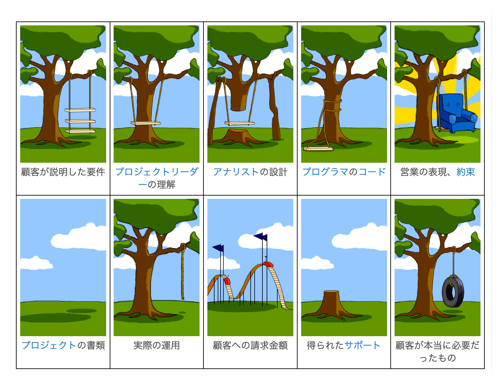

<!-- TailwindCSS を使うための設定 -->

# <!--fit--> ハッカソン手引き

  

    
    

      
yoshikouki

      
GMOペパボ株式会社

    

  

---

# 目次

1. **はじめに**
2. ハッカソンの開発戦略
3. MVP という考え方
4. プレゼンテーションとデモンストレーション
5. 始めましょう

---

<!-- _header: 1. はじめに -->

## 本講演の目的

- MVPを通じた効果的なプロダクト開発
- プロダクト開発の始め方・進め方の羅針盤を得る

## 想定対象者

- プロダクトの初期開発の経験が少ない、もしくは興味ある方
- 「MVP」という言葉を聞いて「もっとも活躍した人」を想起する方

---

<!-- _header: 1. はじめに -->

## ハッカソンの定義

- ハッカソン hackathon = ハック hack + マラソン marathon
- Wikipediaより:
  > ソフトウェア開発分野のプログラマやグラフィックデザイナー、ユーザインタフェース設計者、プロジェクトマネージャらが集中的に作業をするソフトウェア関連プロジェクトのイベントである
- 技術スキルを使って、限られた時間内にアイデアを出し合い、新しいプロダクトをチームで作るイベント

---

<!-- _header: 1. はじめに -->

## 本日のゴール

イベント終了時に「**楽しかった！またやりたい！**」と心から思えること

ゴールでは**ない**もの:
- プロダクトを開発しきる
- 「すごいもの」を作る
- 表彰される

---

<!-- _header: 1. はじめに -->

## アイデアの見つけ方

今回は時間の都合で割愛しますが、以下の本がヒントになります

- 『アイデアのつくり方』
- 『コンセプト・センス 正解のない時代の答えのつくりかた』

---

# 目次

1. ~~はじめに~~
2. **ハッカソンの開発戦略**
3. MVP という考え方
4. プレゼンテーションとデモンストレーション
5. 始めましょう

---

<!-- _header: 2. ハッカソンの開発戦略 -->

## とても大事な前提

- **プロダクトのゴール・正解** を探さない
- そんなものはないし、常に変化し続ける
- プロダクトの目的に沿った **仮説** を立て、それを **検証** する
- その結果、仮説が正しいことは分かるが、それはプロダクトの正解ではない

---

<!-- _header: 2. ハッカソンの開発戦略 -->

## アイデア選択とスコープ設定

### 核となる **体験** (≠ 機能) を特定

- プロダクト説明では「何ができるか」ではなく、「ユーザーとその生活をどのように変えるか」を語る
- 

---

<!-- _header: 2. ハッカソンの開発戦略 -->

### 開発範囲の決定

3つの分類:
1. 「作るもの」
2. 「作らないもの」
3. 「作ったことにするもの」

例：「ユーザー登録とログイン機能」

---

<!-- _header: 2. ハッカソンの開発戦略 -->

### 優先順位付け

- 「必須」vs「あったら良い」体験の区別
- 狩野モデルの活用

---

<!-- _header: 2. ハッカソンの開発戦略 -->

###. 当たり前品質要素
2. 一元的品質要素
3. 魅力的品質要素
4. 無関心品質要素
5. 逆品質要素

※ 品質の話であり、体験や機能そのものではないことに注意

---

<!-- _header: 2. ハッカソンの開発戦略 -->

## 効率的な対話

---

<!-- _header: 2. ハッカソンの開発戦略 -->

### 体験の具現化

- 何よりもまず「体験」を作る
- チームで対話が必要なら、プロダクトを紙の上に書こう

---

<!-- _header: 2. ハッカソンの開発戦略 -->

### フィードバックループの構築

迅速なフィードバックループを作り、常に改善を

---

<!-- _header: 2. ハッカソンの開発戦略 -->

## 迅速な開発手法

---

<!-- _header: 2. ハッカソンの開発戦略 -->

### デプロイファースト戦略

開発の最初にやるのは「プロダクトの公開（デプロイ）」

---

<!-- _header: 2. ハッカソンの開発戦略 -->

### 役割分担の最適化

「コードを書く」だけが開発（エンジニアリング）ではない

---

<!-- _header: 2. ハッカソンの開発戦略 -->

### 進捗の可視化手法

- 公開されているプロダクトが進捗
- 公開されていなければ進捗ゼロ

---

<!-- _header: 2. ハッカソンの開発戦略 -->

## アジャイル原則の適用

アジャイルソフトウェアの12の原則（アジャイル宣言）を「魂」に刻む

---

<!-- _header: 2. ハッカソンの開発戦略 -->

###）

1. 顧客満足を最優先し、価値のあるソフトウェアを早く継続的に提供
2. 動くソフトウェアを、短い時間間隔でリリース
   （ハッカソンなら1〜2時間間隔）
3. 動くソフトウェアこそが進捗の最も重要な尺度
4. シンプルさ（ムダなく作れる量を最大限にすること）が本質
5. 要求の変更を歓迎し、変化を味方につける

---

# 目次

1. ~~はじめに~~
2. ~~ハッカソンの開発戦略~~
3. **MVP という考え方**
4. プレゼンテーションとデモンストレーション
5. 始めましょう

---

<!-- _header: 3. MVP という考え方 -->

## MVPとは

- Minimum Viable Product（実用最小限の製品）
- 定義：最小限の機能を持つ製品
- Wikipediaより:
  > 初期の顧客を満足させ、将来の製品開発に役立つ有効なフィードバックや実証を得られる機能を備えた製品のバージョン
- 目的: **最小限のリソースで最大の学習**

---

<!-- _footer: "" -->

  <a class="text-sm opacity-100" href="https://dic.nicovideo.jp/a/%E9%A1%A7%E5%AE%A2%E3%81%8C%E6%9C%AC%E5%BD%93%E3%81%AB%E5%BF%85%E8%A6%81%E3%81%A0%E3%81%A3%E3%81%9F%E3%82%82%E3%81%AE">
    顧客が本当に必要だったものとは (コキャクガホントウニヒツヨウダッタモノとは) [単語記事] - ニコニコ大百科
  </a>

---

<!-- _header: 3. MVP という考え方 -->

## MVPの重要性

1. 迅速な仮説検証
2. リソースの効率的活用
3. ユーザーフィードバックの早期獲得

---

# 目次

1. ~~はじめに~~
2. ~~ハッカソンの開発戦略~~
3. ~~MVP という考え方~~
4. **プレゼンテーションとデモンストレーション**
5. 始めましょう

---

<!-- _header: 4. プレゼンテーションとデモンストレーション -->

## 核となる「体験」の説明方法

- 核となる「体験」(≠ 機能) を語る
- 「何ができるか」ではなく
- 「ユーザーとその生活をどのように変えるか」を語る

---

<!-- _header: 4. プレゼンテーションとデモンストレーション -->

## プロダクトの背景説明

プロダクトが生まれた背景や動機を共有

---

<!-- _header: 4. プレゼンテーションとデモンストレーション -->

## 機能と技術の紹介

ハッカソンならではの、使用した技術や実装した機能にも触れる

---

<!-- _header: 4. プレゼンテーションとデモンストレーション -->

## 将来ビジョンの提示

今後の展開や可能性についても言及できれば尚良い

---

# 目次

1. ~~はじめに~~
2. ~~ハッカソンの開発戦略~~
3. ~~MVP という考え方~~
4. ~~プレゼンテーションとデモンストレーション~~
5. **始めましょう**

---

<!-- _header: 5. 始めましょう -->

## MVPを通じた学びの重要性の再確認

MVPは単なる製品ではなく、学習と成長の機会

---

<!-- _header: 5. 始めましょう -->

## ハッカソン後の継続的開発

---

<!-- _header: 5. 始めましょう -->

### 「始まり」としてのハッカソン

ハッカソンは開発の「スタート地点」

---

<!-- _header: 5. 始めましょう -->

### 0から1への挑戦の意義

`0 -> 1` がもっとも大変だが、もっとも価値がある

---

<!-- _header: 5. 始めましょう -->

## 創造の楽しさの強調

楽しみながら「創造」していきましょう！

---

# ご清聴ありがとうございました

質問やディスカッションをお待ちしています。