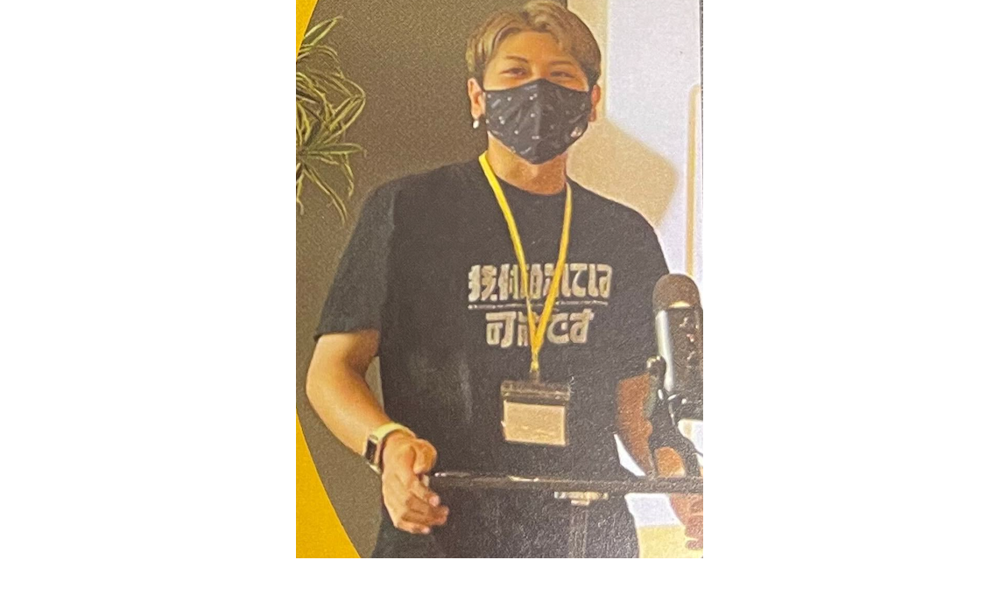
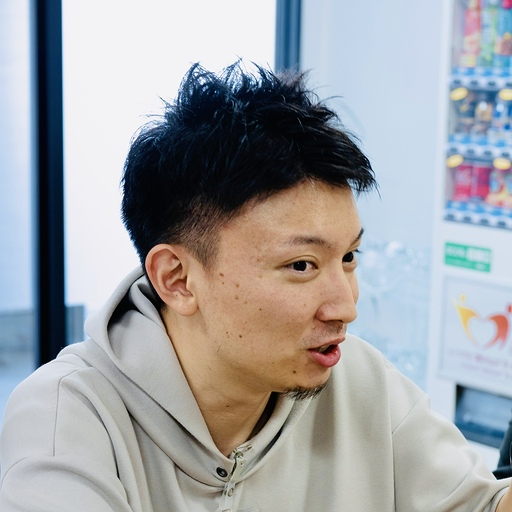

<!-- TailwindCSS を使うための設定 -->

# <!--fit--> お産ハッカソン

オープニング

---

# 目次

1. 運営挨拶
2. 審査員紹介
3. ルール
4. 審査基準
5. 会場説明
6. 「ハッカソン手引き」へ

---

# 運営挨拶

---

# 審査員紹介

  
  
  

---

# ルール
### 1. 開発入る前の事前準備

- Discord チャンネルへのご参加をお願いします。
- GitHub アカウントの作成お願いします

### 2. **開発ルール**

- **制作物のテーマ・制約**：制作物のテーマ、制約はありません。プログラミングを用いた作品であればOK。
- **開発時間**：DAY1・DAY2ともに自由に休憩を取りつつ、開発を行いましょう！
- **メンタリング**：エンジニアのサポートメンバーがいますので困ったことがあれば相談してください！

---

# ルール
### 3. **成果発表**

- **発表形式**：プレゼン資料、動作デモ
- **発表時間**：1チーム5分。質疑応答合わせて10分です。

### 4. **賞金**

- **最優秀賞**：50,000円
- **優秀賞**：20,000円
- **入選**：10,000円

---

# 審査基準
### サービスとしての「おもしろさ」
  - 独創性・有用性などの観点でおもしろいものになっているか
### サービスの「完成度」
  - サービスとしての完成度、機能の実装度、UI/UXのデザイン
### 技術的チャレンジ
  - 新しい技術や難しい技術にチャレンジしているか
---

# 会場説明
- トイレ
- ゴミ箱

---
# 「ハッカソン手引き」へ
