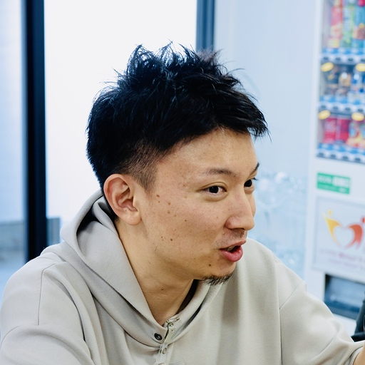

<!-- TailwindCSS を使うための設定 -->

<!-- _footer: "" -->

# <!--fit--> お産ハッカソン

---

# 目次

1. 運営挨拶
2. 審査員紹介
3. ルール
4. 審査基準
5. 会場説明
6. 「ハッカソン手引き」へ

---

# 運営挨拶

---

# 審査員紹介

- 湯舟 武龍 (株式会社ハックツ CEO)
- 村上 将太郎 (monoDuki 合同会社 CEO)
- 吉本 康貴 (GMOペパボ株式会社 事業開発部)

---

# 審査員: 湯舟 武龍

株式会社ハックツ CEO
熊本県出身。九州で数多くのハッカソンを開催している。
学生エンジニアに特化したサービスを展開する株式会社ハックツを2018年に設立。地方で眠る学生を「ハックツ」するために、イベント事業、開発事業など行なっている。
2021年に福岡市が開催する「エンジニアフレンドリーシティ福岡アワード」を受賞。

---

# 審査員: 村上 将太郎

monoDuki 合同会社 CEO
1997年、鹿児島県生まれ。鹿児島高専を経て鹿児島大学大学院に在学中。幼少期から地元で挑戦のロールモデルになりたいと起業家を志し、高専在学時に2次流通とweb開発の事業を興す。2020年から、挑戦者を増やすことを目的に、鹿児島市と協力しスタートアップのインキュベーション・支援を開始。2023年、ARやVRなどのXRクリエイティブやDXを手がけるmonoDuki合同会社を設立。

---

# 審査員: 吉本 康貴

鹿児島大学を卒業後、地元で理学療法士として働いた後、独学でITエンジニアリングを学び、2020年にGMOペパボにエンジニアとして入社。

GMOペパボでは複数の新規サービス立ち上げに携わっている。

---

# ルール説明

1. 開発に入る前の事前準備
2. 開発ルール
3. 成果発表
4. 賞金

---

# 開発に入る前の事前準備

- Discord チャンネルへご参加ください
- GitHub アカウントを作成してください

---

# 開発ルール

- 制作物のテーマ・制約はありません
  - プログラミングを用いたプロダクトであればOK
- 開発時間
  - 自由に休憩を取りつつ、楽しく開発を行いましょう！
  - DAY1 は、22時が完全退出時間です
- エンジニアのサポートメンバーがいますので、
  困ったことがあれば何でも相談してください！

---

# 成果発表

- 発表形式
  - **動作デモ・公開URLの提示** を推奨します
  - プレゼン資料に指定はありません
- 発表時間: **5 分**
  - 公平を期すため、発表途中でも5分経過したら終了します
  - 質疑応答を含めて合計10分です

---

  

    

      <h2 class="flex gap-4 text-4xl font-black text-white text-center">
        
🏆
賞金
🏆

      </h2>
      

        
1位

        
50,000円

      

      

        
2位

        
20,000円

      

      

        
3位

        
10,000円

      

    

  

---

# 審査基準

### サービスとしての「おもしろさ」
- 独創性・有用性などの観点でおもしろいものになっているか
### サービスの「完成度」
- サービスとしての完成度、機能の実装具合、UI/UXのデザイン
### 技術的チャレンジ
- 新しい技術や難しい技術にチャレンジしているか

---

# 会場説明

- 飲食はご自由に
  - 会場後方に設置している飲み物・お菓子はご自由に召し上がってください
  - エナジードリンクは株式会社ハックツ CEO **湯舟武龍** さんからのご厚意です
- 昼食は運営で用意しています
- トイレ: 後方を向かって右側にあります
- ゴミ箱: 会場後方に設置されています
- 2階の会議スペースを貸し出すことも可能です。ご相談ください

---

# お気軽にご相談ください

困りごとからご相談まで、何でも運営メンバーへご相談ください

---

# ハッカソン手引き