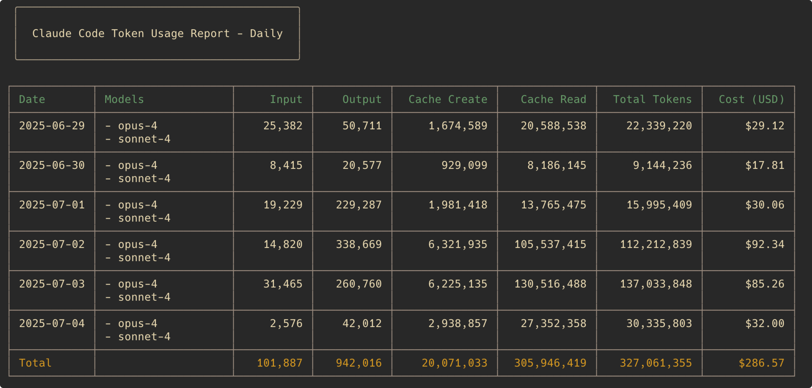

<style>
  :root {
    --primary: #00A9FF;
  }
  section {
    padding: 4rem;
    justify-content: start;
    padding-top: 4rem;
  }
  h1 {
    color: var(--primary);
  }
  h2, h3, h4 {
    color: var(--primary);
  }
  strong {
    color: var(--primary);
  }
  ul, ol {
    padding-left: 1.2rem;
  }
  li {
    line-height: 1.8;
    text-indent: 0.3rem;
  }

  /* Styling page number */
  section::after {
    bottom: 1rem;
    font-weight: 100;
    font-size: 1rem;
    content: attr(data-marpit-pagination) ' / ' attr(data-marpit-pagination-total);
  }

  /* Center specific slides */
  .center {
    justify-content: center;
    align-items: center;
    text-align: center;
  }
</style>

<!-- _paginate: false -->
<!-- _class: center -->

# Raspberry Pi 5 × Claude Code

## 生活が破綻するまでの記録

---

<style scoped>
  .profile-container {
    display: flex;
    align-items: center;
    gap: 2rem;
    margin-top: 2rem;
  }
  .profile-image {
    width: 150px;
    height: 150px;
    border-radius: 50%;
  }
  .profile-info {
    flex: 1;
  }
</style>

# 自己紹介

<div class="profile-container">
  
  <div class="profile-info">

**yoshikouki**

GMOペパボ株式会社  
事業開発部 エンジニアリングリード

- 2020年入社 / 鹿児島オフィス勤務
- 最近 Raspberry Pi 5 を購入
- X: @yoshikouki_ / GitHub: yoshikouki

  </div>
</div>

---

# 構成

- **Raspberry Pi 5** - 個人開発用サーバー
- **Claude Code** - 開発を任せる
- **Tailscale** - VPN接続
- **tmux** - 作業状態の永続化

どこからでも、いつでも開発が続けられる環境

---

# 接続環境

```
[MacBook] ─┐
            ├─ Tailscale VPN ─→ [Raspberry Pi 5]
[iPhone]  ─┘                       └─ tmux
  └─ Termius (SSH Client)              └─ Claude Code
```

**結果**: いつでもどこでも Claude Code に開発させられる

---

<!-- _class: center -->

# 感想

## **生活が破綻します** 🫠

---

# 気付いたこと

## タスク粒度が小さすぎた問題

- ライブラリ選定・設計を自分でやりたがる
- Claude Code の判断を信用しきれない部分
  - 特にセキュリティ関連

**解決策**: コンテキストリセットせず auto-compact に委ねる

---

# 新しい開発サイクル

## 高速実験サイクル

1. **Issue を投げる** 📝
2. **走りきってもらう** 🏃
3. **知見を溜める** 📚
4. **コードを破棄する** 🗑️
5. **知見を元に強くて New Game** 🎮

---



<!-- この画像は後で実際のccusageの結果に差し替える必要があります -->

---

<!-- _class: center -->

# まとめ

**Raspberry Pi 5 × Claude Code**

便利すぎて生活が破綻する

でも、開発効率は爆上がり 🚀